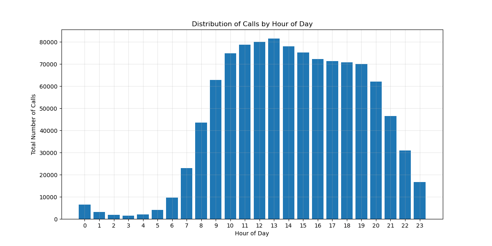

# GRANDATA - Ejercicio de Data Engineer

## Ejercicio 1 - Spark + Docker
1. **Calcular el monto total** que facturará el proveedor del servicio por envíos de sms.
- **Monto toal a facturar: $1,696,022.50**

2. **Generar un dataset** que contenga los ID de los 100 usuarios con mayor facturación por envío de sms y el monto total a facturar a cada uno. Además del ID, incluir el ID hasheado mediante el algoritmo MD5. Escribir el dataset en formato parquet con compresión gzip.
- [Dataset](output/top_100_users_ds/)

3. **Graficar un histograma** de cantidad de llamadas que se realizan por hora del día.

---

## Ejercicio 2 - Preguntas Generales

### 1. Administración de Recursos en Cluster Hadoop

La empresa cuenta con un cluster on premise de Hadoop en el cual se ejecuta, tanto el data pipeline principal de los datos, como los análisis exploratorios de los equipos de Data Science y Data Engineering. Teniendo en cuenta que cada proceso compite por un número específico de recursos del cluster:

- **¿Cómo priorizaría los procesos productivos sobre los procesos de análisis exploratorios?**

- **Debido a que los procesos productivos del pipeline poseen un uso intensivo tanto de CPU como de memoria, ¿qué estrategia utilizaría para administrar su ejecución durante el día? ¿qué herramientas de scheduling conoce para tal fin?**

### 2. Optimización de Performance en Data Lake

Existe una tabla del Data Lake con alta transaccionalidad, que es actualizada diariamente con un gran volumen de datos. Consultas que cruzan información con esta tabla ven afectada su performance en tiempos de respuesta.

- **Según su criterio, ¿cuáles serían las posibles causas de este problema?**
- **Dada la respuesta anterior, qué sugeriría para solucionarlo.**

### 3. Configuración de Recursos en Cluster Spark

Imagine un clúster Hadoop de 3 nodos, con 50 GB de memoria y 12 cores por nodo. Necesita ejecutar un proceso de Spark que utilizará la mitad de los recursos del clúster, dejando la otra mitad disponible para otros jobs que se lanzarán posteriormente.

**¿Qué configuraciones en la sesión de Spark implementaría para garantizar que la mitad del clúster esté disponible para los jobs restantes?**

Proporcione detalles sobre:
- La asignación de recursos
- Configuraciones de Spark
- Cualquier otra configuración relevante

---

**Nota:** Incluir las respuestas a las preguntas dentro del README.

### Respuestas

#### Commandos útiles:
Docker image build \
`docker build -t pyspark-notebook:latest .`

Run jupyter-lab/notebook:
```
╰─± docker run -it --rm -p 8888:8888 -p 4040:4040 -v $(pwd):/home/jovyan/work pyspark-notebook:latest
```


